<!--
  GitHub Profile README for NguyenDongHaiPen
  Repo: github.com/NguyenDongHaiPen/NguyenDongHaiPen
-->

<table>
<tr>
<td valign="top"></td>
<td valign="top"></td>
</tr>
</table>

## Nguyễn Đông Hải

**Developer · Student · Creator**

<!-- Uncomment and fill in your links when ready:

-->

 

<!-- animated contribution graph, refreshed daily by the workflow -->

